#+Title: Remembering The Kelly Farm
#+Author: Tyler Burns
#+Date: August 20, 2026 - September 7, 2026

[[./index.html][Home]]

-----

/So we beat on, boats against the current, borne back ceaselessly into the past./

Francis Scott Fitzgerald, /The Great Gatsby/ [1]

-----

* The mystery
Every childhood has some element of mystery to it. That one house on the corner. That one neighbor. That one time. Whatever it is. One of mine, and a lot of the kids on my street, involved what you see when you made a right from my suburban street in Sacramento CA, Meyer Way, onto the main road Winding Way. You go one street over and suddenly what is otherwise boring suburbia opens up into an old lot that goes back farther than the eye can see. A bunch of old vegetation. A small old narrow road behind a gate that goes back. And there is a big field. And a stable. With horses. Private horses in the suburbs. And some house that is so far back that you can't even see it from Winding Way.

My mom and neighbors called it something like "the multi-acre lot." We knew nothing about it otherwise. We never met the neighbors. We never trick-or-treated over there for Halloween (Winding Way wasn't safe to walk down). They just kinda did their own thing and we kinda did ours. There was one time where I saw someone riding a horse when we drove by. And aside from that, it was just some permanent anomaly that we lived with, to the point where we forgot just how anomalous it was.

Every once in a while we would hear a horse neigh. Or on a hot summer's day if the wind was blowing the right direction, we would smell the horses. But that's about it. Oh, and one of my friends on the street had a back yard that bordered the part of the lot with the horses. I remember going out there once and being descended on by more flies than I had ever seen in one place. Flies of all sizes. Of note, they moved a few blocks over. But anyway that was it. Big boring suburbia all directions. And then...horses?

Well. It turns out that this anomaly was actually something much weirder than I could have imagined at the time.
* The farm
I will now tell you about a research rabbit hole I've been down in the past couple of days, that has absolutely nothing to do with my job. But this is what happens when you give an ADHD kid a PhD.

My sister messaged me a while back. She found the property on [[https://www.zillow.com/homedetails/6605-Winding-Way-Carmichael-CA-95608/26036764_zpid/][Zillow]]. 6605 Winding Way. It's a 2.15 acre lot. 8 or 9 houses deep on both sides. But that's not the interesting part. The interesting part is that this is a surviving farmstead remnant of the so-called Kelly Farm! This is the property that was there before my house and the rest of them were up.

Specifically, I found that this was a [[https://goldennuggetlibrary.sfgenealogy.org/sacbio4.htm][211 acre]] farm bought out of the much larger Rancho San Juan. This is the farm that basically got subdivided into houses between the 60s and the 80s. My childhood home was formerly some small patch of land on the Kelly Farm. This is an old farm. It was purchased in 1882. We're talking a few decades out from the Civil War and Gold Rush. And that was the surviving remnant! One backyard behind me and to the left, going clear to the end of the street. 2.15 acres of rural land with horses among suburbia.

So is this becoming a museum? No! It was sold in 2015 after being advertised as a "[[https://www.redfin.com/CA/Carmichael/6605-Winding-Way-95608/home/19192122][fantastic in-fill opportunity]]." This suggests that it could all be torn down to become houses down the line.

You can imagine I'm kinda mad about this. I think it should be a museum or something. As far as Sacramento suburbs go, this is as historical as you're going to get. To this end, I am writing this in part to simply preserve the memory of this magic historical wonderland that was literally one street over my entire childhood. So to that end, I did some research to get a better feel for what this place really is. We'll start with the property and the house itself.
** The property
So first, let's actually look at this thing so you can see what I'm talking about:

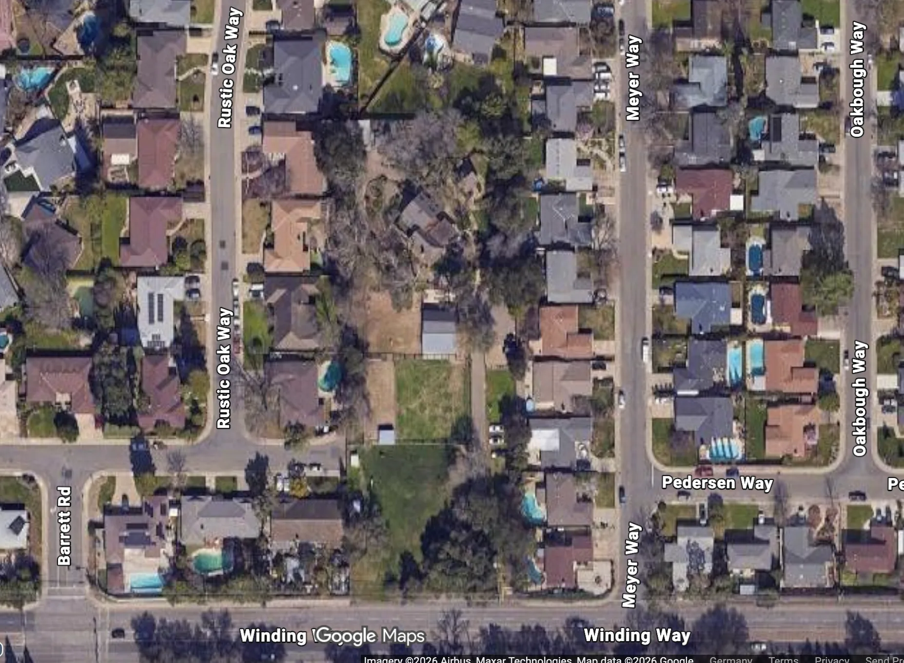

Can you see how there's that patch of green in the middle and houses on either side? That's it. That's the remnant. And I'm showing you a zoom out so you can see the boring suburbia enclosing it.

Before we move further, what I want to do is convince you that this is in fact a surviving farmstead remnant of the Kelly Farm. We have some good evidence, from the actual [[https://recordersdocumentindex.saccounty.gov/DocumentViewer/HTML5Viewer.html?InternalID=23771559&EnableSave=false&DocumentNumber=188203060571&DocumentClass=Deed&ApiUrl=https://recordersdocumentindex.saccounty.gov/SearchService/api/][1882 Kelly deed]], which describes a 211.72-acre rectangle that includes what is now the 6605 Winding Way property [2]. 

Aerial images add the next part of the story: how this small rural/equestrian area survived while nearly everything around it became suburbia. Sacramento keeps detailed flyover photographs that go back to the 50s.

Now the annoying thing is that these images are all copyrighted, so I can't paste them into this article here. But I can give you the [[https://www.historicaerials.com/viewer][site]]. Just type 6605 Winding Way into the search bar. Then click "aerials." Then click on the years. You'll notice that there are houses back to 1984. But in 1966 they're gone. But that little area where the Kelly Farm remnant is stays. House and all. So that strongly suggests that this is the surviving farmstead portion of the Kelly Farm.

You'll see other weird things. You'll see in the 1966 and earlier photos a rectangular patch of trees a bit farther up. I have no idea what that is, and it's gone now, under houses and roads and such. I don't see any driveways or road or houses or anything. But it's still a bit weird that such a nicely rectangular patch of trees would be right there.

I'll note one more thing here. My neighbors to my left were I think two of the first residents who showed up when all of it got converted to houses. They told me that when they showed up on Meyer Way, they could see clear down to the local elementary school (called Thomas Kelly, and yes it /is/ related to the Thomas Kelly who the farm is named after), because there were no houses in the way.

I did not get a chance to ask them about the lot. But they might know a few things that I don't in that regard. I'll update this article if I get any more information.

So now we're going to look at the lot itself, and focus on the architecture of the house.

Looking a bit closer now we can see the area where the horses are. It basically takes up the bottom half of the lot. This was the part we could see driving by.

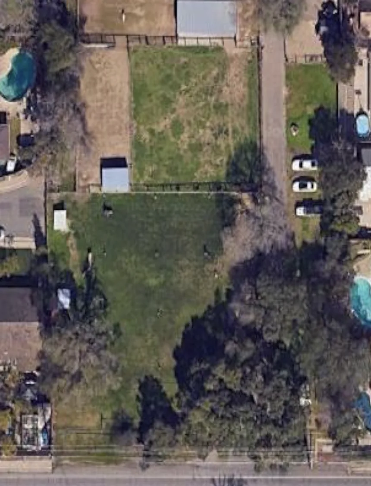

But if we look behind that, we can see what we could only get glimpses of peering through the fence of the right neighbor's back yards. The house. Which is a very different style and architecture than anything nearby.

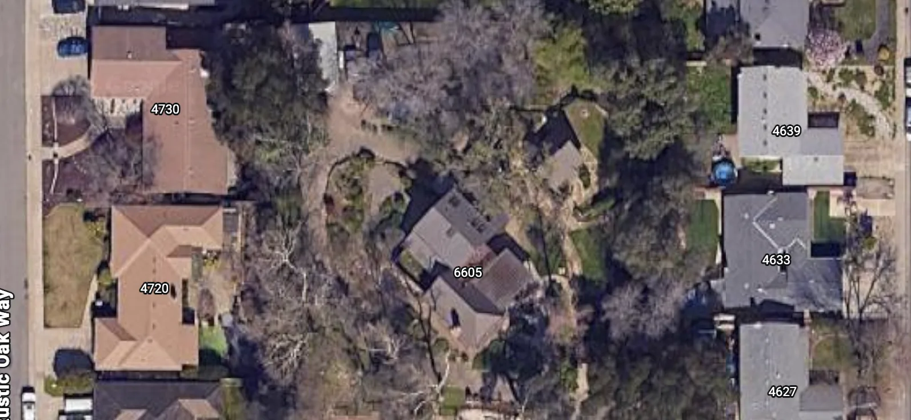
** The house, what we know
I include the other houses here to show you that it was nothing particularly large. As a kid, I didn't know if there was a mansion back there or something. Here, we're dealing with a similar size to the larger of the suburban houses built around it, but very different architecture. 3-D "imputation" from the satellite data gives us a bit more granularity.

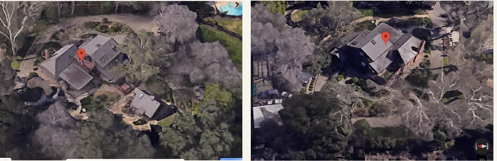

Redfin gives this a 1950 [[https://www.redfin.com/CA/Carmichael/6605-Winding-Way-95608/home/19192122][build date]]. That would suggest that there were one or more older homes on this farm land between 1882 and that point. Perhaps in this area or perhaps elsewhere on the farm. I could not find the answer. Now ChatGPT's image analysis pointed to "California Ranch" as the [[https://ohp.parks.ca.gov/pages/1054/files/pasadena%20context%20report%20final%20revised%202007%2010%2010.pdf][style]]. With a "[[https://en.wikipedia.org/wiki/Swiss_chalet_style][swiss chalet]]" substyle. On the latter, it sort of makes sense if you look at the steep roofs of the guest house.

Zillow doesn't give us any clear images of the main house (actual source: MetroList Services of CA). But the guest house looks sufficiently clear, as you can see below:

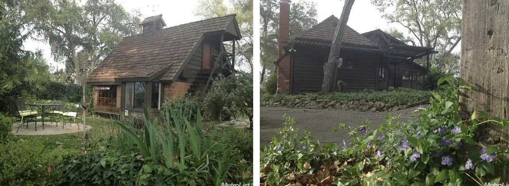

If you go back to that 3-D photo above, I think the image of the main house was taken from the bottom left of the photo on the left panel. Where you're facing the patio and the two-story portion rises behind it.
** The house, AI reconstruction attempt
What I then did, in order to whet my curiosity, insofar as I'll never be able to actually set foot in this place, let alone the property, is I took every satellite image I could, plus the Zillow images of the house, and I fed those into ChatGPT's image generation feature, along with the context around the year it was built, style of architecture, and so forth. This gave us some interesting speculative pictures as to what the main house might have looked like. And from that, I got this absolute beauty:

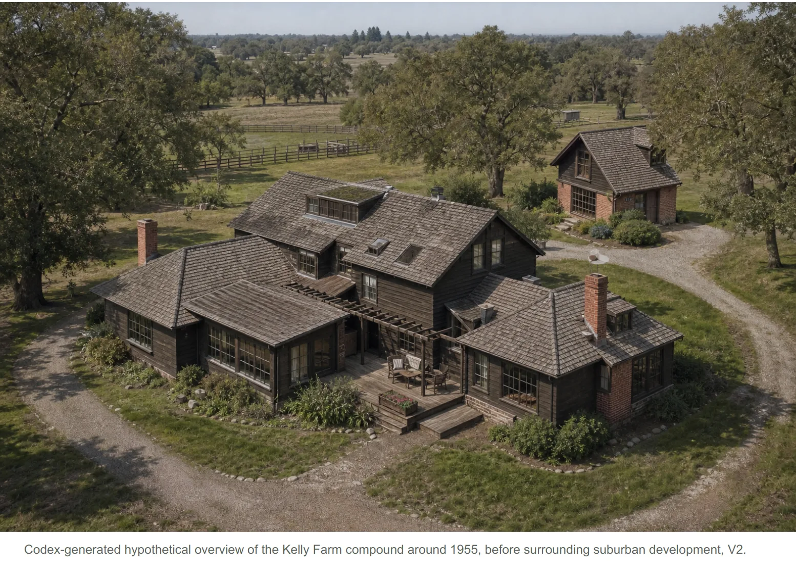

I'll note that there are a number of inaccuracies that I found in the images (so don't take this as gospel). But it's the closest thing I've got to nailing the apparent complexity, and especially the "spirit" of the main house from the terrible angle that the only photo of the main house gives us.

Beyond that, I had ChatGPT take the images and produce a hypothetical floor plan from the images and other context. While these were wishy washy, one of them that looked decently accurate was the loft in the guest house:

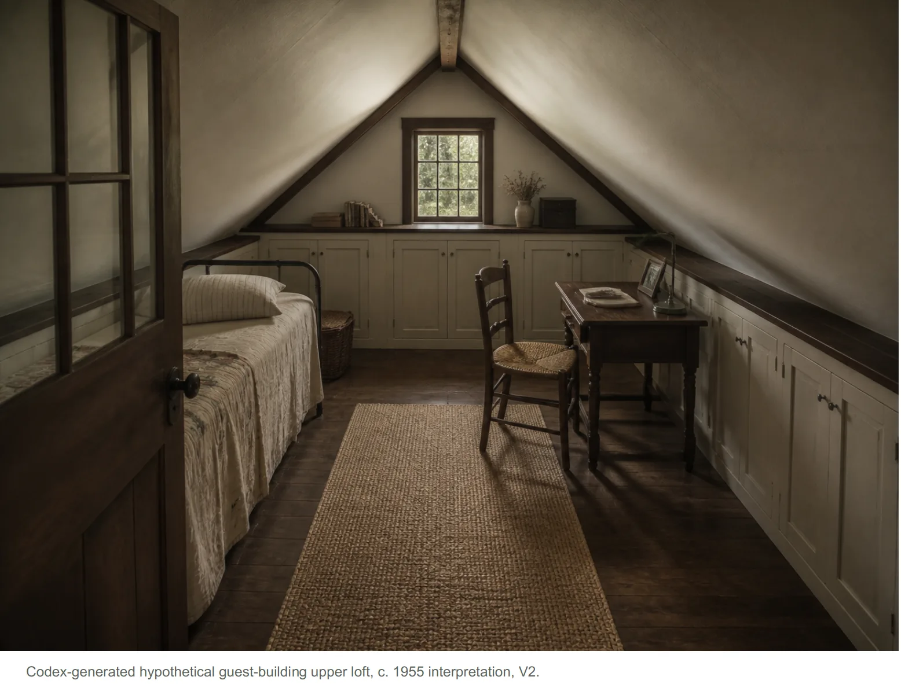

You're not going to get this kind of thing from any of the houses built around it after 1966.

I'm going to keep this "reconstruction" thread open, as future models and higher resolution satellite data down the line might do us some good here.
** Open questions
In my research, I found that Thomas Kelly had a [[https://www.fairoakshistory.org/books/SJUSD/cowan011.pdf][one-room school house]] on the property in the early 1900's, somewhere near the intersection of Winding and Dewey, which would be the southeast corner of the farm. I found that the school house was later physically moved and then destroyed. I looked really hard for remnants of where a school house could have been, but I found none. The only anomaly I noted was at the corner of Winding and Dewey there is a tiny little strip of commercial zoned land with maybe three or four small shops (e.g. a quick stop, dry cleaners), and a large water tank. It seems strangely out of place. But I later found that this little strip was zoned in during the suburban transition, and does not pre-date it. But still, the choice of having a tiny commercial zone /right there/ is a bit weird. So maybe the Kelly Farm had some stuff going on over there, that influenced the decision. Like a school house?

I know nothing of the people who were there when I was growing up. Whether they are descendants of the Kelly family. Note that there were two Thomas Kellys. The one who bought the land, and his son, who set up Thomas Kelly Elementary School, where I went to school. But further descendants, I do not know. I read that the family moved to the Bay Area for a time (way back), but that's about it. I just know of that one instance where I saw someone riding a horse. This would have been the 90s. It was also suggested, from Zillow, that there was a "groundskeeper" on the farm, but not actual residents. So...where are these descendants? And would any of them be up for a coffee next time I'm in town?

The architecture of the main house is still a mystery. I noted that the AI could not fully infer out what was going on. And even with mult-angled satellites, it's still a weird looking house. What it actually looks like (not including the guest house) is a house that was serially built out. There are two "wings" that look to be narrowly connected with a tiny gap between them for the most part, with the other one having a second story that looks something like a loft, similar to the guest house (which itself has somewhat different architecture given the steep roofing). What that separation actually is, I have no idea. One of those "wings" is the original house and then an "addition" was built later on (and whether the addition was the 1950 build cited by Redfin) I don't know.

And the bigger mystery of the house: what did the house look like pre-1950? Presumably there was some sort of living quarters between 1882 and 1950 as well. Was the farm house even there? When I looked at a 1947 aerial view of the area, the patterned trees and driveway and such were still there, suggesting that this is still where the farmhouse was. But I did not have enough resolution to see the house itself.

I will note that in the 1947 view I found a clear image of a house sitting on what is now approximately 4726 Paxton Court. This house was no longer around in the later photos of the area pre-suburbs. I'll note that I do not see evidence of any old architecture at the site of that first house, but I do note that the trees in the back yard of that property appear to be from the 1947 aerial image that I saw. I would wonder if there is anything buried underground on that property that the suburbs were built on top of. But I could not find any more information on this at the time of writing [2026-09-07 Mon].

And finally, there are other open areas of land that were presumably part of the Kelly Farm at one point. Thomas Kelly Elementary and the "nature area" behind it. Del Campo High School and the neighboring Del Campo Park, where I used to go as a kid and collect tadpoles from the creek and take care of them until they turned into frogs. There might be little Kelly Farm "artifacts" in these parts that have been overlooked (at least by me). There are a lot of large oak trees, presumably around during the farm era. Maybe one of those "boy heart girl, 1931" things was etched into one of them a long time ago. Or a boulder or something. Maybe there's a little monument or plaque that I just haven't seen.
* The farm era, the rancho era, and the rabbit hole of history
In short, this is part of a whole "farm era" for this part of town. I found an 1885 map of Sacramento from the Library of Congress [[https://www.loc.gov/resource/g4363s.la000034/?r=0.422,0.114,0.301,0.155,0][here]] that shows the extent of it. If you zoom in, you get this:

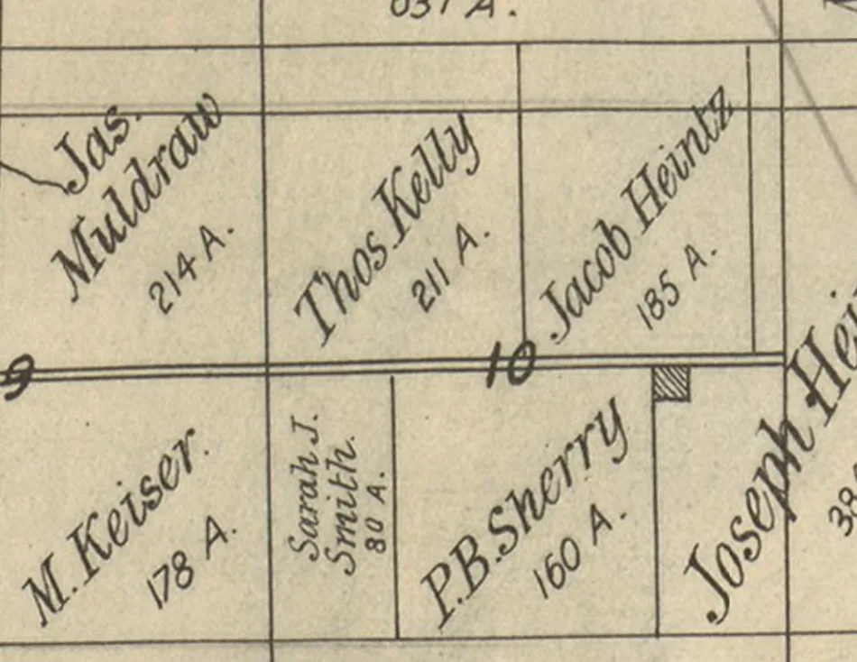

The southern boundary of the Kelly portion corresponds to what is now Winding Way. P.B. Sherry is south of it (and the southern boundary of that appears to be what is now Lincoln Avenue). Kelly is north. To the east of the Kelly portion is what is now Dewey Drive, where my former high school, Del Campo, is located. You can see this if you look at the aerial images, as the farm was still around when Del Campo was initially built. To the west is approximately what modern day Jan Drive is, where it intersects Winding. It's a bit ambiguous as to whether Thomas Kelly Elementary School sits entirely within the former Kelly Farm boundaries. And the north is also a bit ambiguous, but it appears to be a few suburban streets north of the northern border of Del Campo High School, around Oakcrest where it intersects Dewey.

And this opens up all kinds of additional rabbit holes. The Kelly Farm has an interesting history. These other farms are going to have their own histories as well. And perhaps historical remnants. I'm not going to talk about it in this article, but the plot marked "P.B. Sherry" was bought later by a guy with the last name O'Donnell. Within his farm, he in turn set up what is known as Shelterwood (4434 Mapel Lane, Zillow [[https://www.zillow.com/homedetails/4434-Mapel-Ln-Carmichael-CA-95608/26052698_zpid/][here]]). This is another carved out multi-acre farm remnant that is so hidden that I missed it my entire childhood, despite being right across the street from Barrett, my middle school. This one does not have horses so far as I saw, but the house is absurdly huge, much more well photographed, and the property is shockingly cheap.

All in all, who knows what other weird remnants from the "farm era" are lurking in this little corner of Sac.

And let's not forget that before the "farm era" there was [[https://en.wikipedia.org/wiki/Rancho_San_Juan][Rancho San Juan]], a just under 20,000 acre Mexican land grant, from which the Kelly Farm was bought. Found a map of that [[https://www.citrusheights.net/506/Part-1-1844---1861][here]]. But I'll paste the image below.

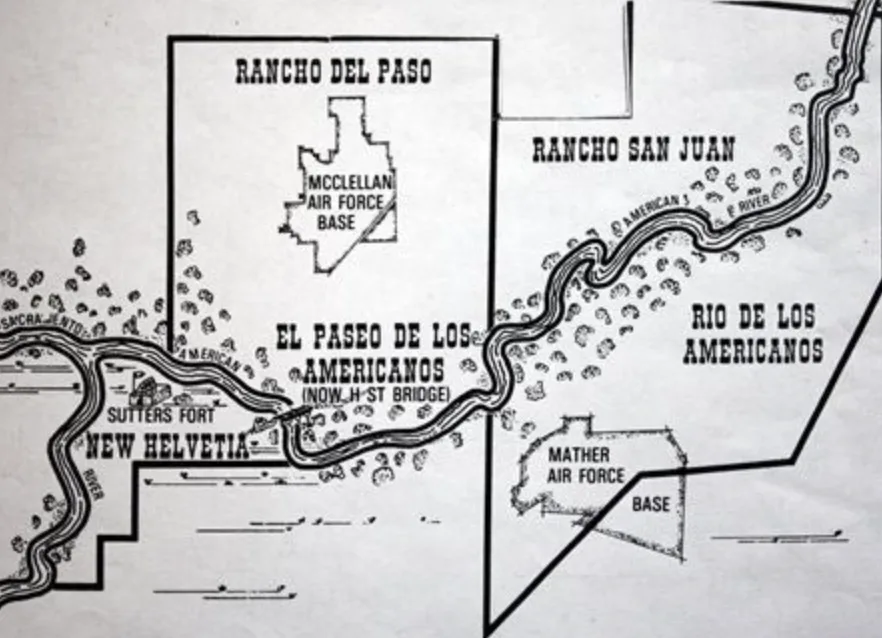

I don't know yet if there are any magic remnants of Rancho San Juan equivalent to mysterious multi-acre farm lots or other anomalies, but I do know that San Juan Avenue was a few blocks from the house, and it was how we got to Raley's for groceries, and later was on one of my jogging routes in high school (I've got a good map in my head of the area because this was before GPS).

Anyway these [[https://en.wikipedia.org/wiki/Ranchos_of_California][Ranchos]], these land grants, were apparently made by the Spanish and Mexican governments between 1775 and 1846. We learned about this in California history I want to say in the 4th grade. It was the year that we learned about missions (which were the big "properties" prior to ranchos), and each of us had to write a report on one, which involved building a 3-D model, which involved all of the parents getting involved because such a thing would be impossible for a 4th grader to do. We fortunately did not have to do this for the ranchos too. But I digress.

All of this to say that a weird multi-acre lot near my house is a window to a "farm era" which is a window to a "rancho era" which is a window to a "mission era" and now you're steeped in a history much richer than you'd think just being in some boring suburb.
* Interlude: on enchantment
A brief digression on enchantment. Because it's my essay.

This multi-acre lot was enchanting as a kid. Because it was "beyond my grasp." Unanswered questions begetting unanswered questions. I would always get a jolt of awe and wonder looking as far back as I could, in the brief seconds we drove by when I was the passenger looking out the window and my mom had the wheel on the way to wherever.

Now that we have the internet and satellite views and AI to do synthesis and generate hypothesized images and such, we have a lot more "answers" than we used to. If I had all of these answers as a kid would it kill the enchantment?

I don't think so.

Here is a perspective for the reader, from the PhD side of things. First thing: a PhD is not special. You can do it too. It's basically a multi-year pursuit of your curiosity, which is something that only works when you realize that every answer will [[https://tjburns08.github.io/its_more_complicated_than_that.html][beget new questions]]. And further: every answer will beget more than one question. And even further: some answers will beget questions that you previously were not able to ask, which will unlock entire new dimensions of curiosity, which will gobsmack you with more awe and wonder than you ever thought possible.

So it's like this. The Kelly Farm. I have a bunch of answers now that I didn't have. But you saw above that I still have quite a lot of open questions. And my mental model of the thing has moved from "weird multi acre lot" to "living physical portal to entire historical eras that are slowly being forgotten." Paradoxically the Kelly Farm remnant is both smaller, given that I can see most of it with satellite now and do research on it through my laptop, but also much bigger, because it now connects to an entire world that no longer exists except for living descendants and remnants that were not (yet) destroyed.

I think the issue is that enchantment is easy as a kid because everything is new. But I think in an era where you can get a lot of answers very fast, enchantment takes work. This is the PhD insight. That you get answers, and then you have to do some work to find the boundary between what is answered and what is not.

So I think enchantment takes work. Active work. It's less of a given these days. The internet and satellites and AI is not killing enchantment. It's just increasing the amount of work it takes to get from answer to question. That's an interesting way to put it, right? Because we have this idea that we need to go from question to answer. But enchantment involves going from answer to question. And that takes work.

But I'm pretty damn enchanted at this point. And note that I'm writing this from Berlin, Germany. My current home. And if you know anything about Berlin, you'll know that it is the "final boss" of enchanting (and disturbing) historical rabbit holes.

But this European "history-centric" lens that I've developed over here, where there's all kinds of castles and old buildings and such, can indeed be applied to Sacramento suburbs too. You just have to look a bit harder. Where are the anomalies? And why are they there?

Alright, interlude over. Time to wrap this essay up. Point is: enchantment takes work. You have to work for it. But if you do...well...look at what the multi-acre lot turned into throughout the course of this research. Back to the essay.
* Conclusions
What I saw as an anomaly as a kid. A large plot of land with horses that looks nothing like the rest of the boring suburbs I grew up in. What I saw was actually a portal to a lost era of this part of Sacramento. One of farms. And those, via the purchase history, are a portal to a much bigger and much weirder era of Ranchos.

I've done some research here, and this has been nice. I would have forgotten about the place had my sister not found the listing on Zillow. Ironically, because it was sold after being marketed for redevelopment, I did this research project. If it was still quietly owned by Thomas Kelly's descendants, I would still know nothing (though the satellite photos would still pique my interest, and looking at this place was one of the things I immediately did when Google Maps became a thing).

You know what I should have done back in the day? I should have written a letter and slipped it into their mail box. I'd be able to get away with it because I was just a curious kid. But for whatever reason, we never thought to do that. Reaching out to people now is almost a reflex because I run a company and outreach is what ultimately puts food on the table (if no one knows about your services, you can't sell them). But alas, I did not have this "outreach reflex" back in the day. But I have it now! And there are probably living descendants...

The Kelly Farm remnant is not protected, it was bought in the context of an in-fill opportunity, and may soon give rise to houses (I note that a 400-foot [[https://homeflock.com/dir-permits/Plumbing/Carmichael%2BCA/205][sewer line]] was run through the property in 2015 around the time of purchase, which might suggest some future construction). And the O'Donnell remnant that I hinted at earlier is also going to be [[https://files.ceqanet.lci.ca.gov/282288-1/attachment/zDnd_V2nvdTD9ojM93PJBf6BFNRtw1d6AcHWmLg9JFrfecXHeKzTa7_scSlxabfe0VIYOcsL0wjiYvyc0][subdivided into houses]] (though it looks like they're going to keep the main house). Soon, the weird anomalies in this suburb that marked that transition from the farm era to the house era may be gone. And with it, the memories and the history that came with it. This is why museums are a thing. So we can remember what we once were and how far we have come. So we don't take what we have now for granted.

But the Kelly Farm is now vulnerable to development. And if that happens, the new kids on Meyer Way are not going to hear horses, smell them in the summer, or get bombarded by flies in certain back yards. No one is going to know about this. So this article's purpose is to serve as an online artifact that the property could otherwise physically have been if it were converted into a museum. From a man who (among his former neighbors) remembers this enchanting thing from his childhood, and therefore had enough motivation to research this and write it up.

-----

Footnotes

[1] A quote that still haunts me to this day, after having read The Great Gatsby junior year in high school. It's one of those things that shakes you early in life and you don't exactly know why, and slowly as life progresses it starts to make more and more sense.

[2] Here is a long footnote about the actual deed itself. I'm going to go ahead and paste the two images and then after that, the AI-transcribed text (given that the text itself is very hard to read). Note the funny units, like "chains."

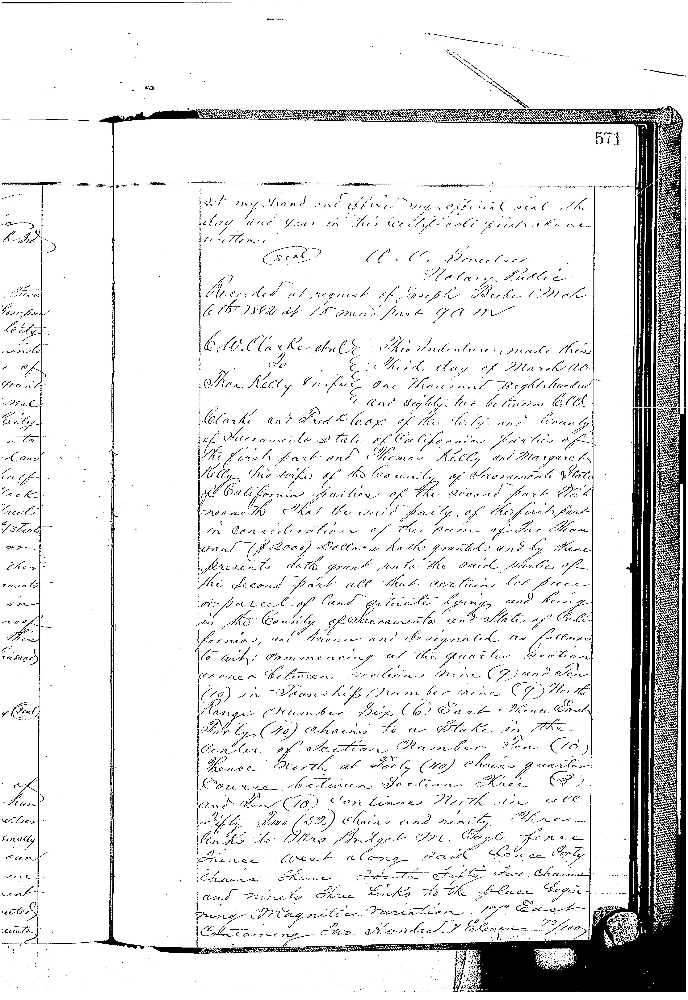

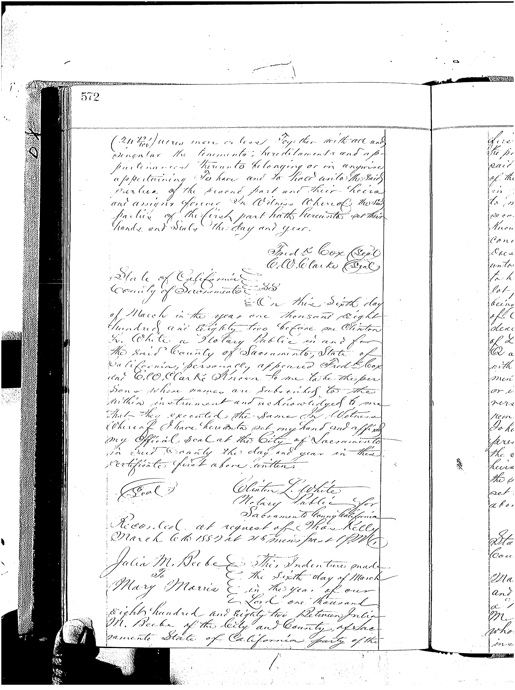

And the AI-assisted transcription is here:

#+begin_quote
This Indenture made this Third day of March A.D. One Thousand Eight Hundred and Eighty two between C. W. Clarke and Frank Cox, of the City and County of Sacramento, State of California, parties of the first part, and Thomas Kelly and Margaret Kelly, his wife, of the County of Sacramento, State of California, parties of the second part:

Witnesseth, that the said party of the first part, in consideration of the sum of Two Thousand ($2,000) Dollars, hath granted, and by these presents doth grant, unto the said parties of the second part all that certain lot, piece or parcel of land situate, lying and being in the County of Sacramento and State of California, and known and designated as follows, to wit:

Commencing at the quarter-section corner between Sections Nine (9) and Ten (10), in Township Number Nine (9) North, Range Number Six (6) East, thence East Forty (40) chains to a stake in the center of Section Number Ten (10); thence North, at Forty (40) chains, quarter corner between Sections Three (3) and Ten (10); continue North in all Fifty-two (52) chains and Ninety-three links to Mrs. Bridget M. Coyle fence; thence West along said fence Forty chains; thence South Fifty-two chains and Ninety-three links to the place beginning. Magnetic variation 17° East. Containing Two Hundred and Eleven and 72/100 (211 72/100) acres, more or less.

Together with all and singular the tenements, hereditaments and appurtenances thereunto belonging or in anywise appertaining.

To have and to hold unto the said parties of the second part and their heirs and assigns forever.

In Witness Whereof, the said parties of the first part hath hereunto set their hands and seals the day and year.

Frank K. Cox (Seal)
C. W. Clarke (Seal)
#+end_quote

I note that "East, thence East Forty (40)" had a "Mount Diablo" snuck in there in the transcription, and I did not see that in the deed when I read it, so I deleted it from the transcription. So that speaks to the image translation not being perfect. Or my eyes not being perfect. One of those.

The AI-generated summary of the deed and the context around it is here.

#+begin_quote
The instrument recorded on 6 March 1882 identifies C. W. Clarke and Frank Cox as grantors and Thomas Kelly and Margaret Kelly, his wife, as grantees. The stated consideration is $2,000. The deed is recorded in Book 104 beginning at page 571 and is indexed by the County as 188203060571 (internal record ID 23771559).

The deed describes the land by Public Land Survey System corners and measured courses:

1. Begin at the quarter-section corner between Sections 9 and 10, Township 9 North, Range 6 East.
2. Go east 40 chains to the center of Section 10.
3. Go north 40 chains to the quarter corner between Sections 3 and 10.
4. Continue north to a total northward distance of 52 chains 93 links.
5. Go west 40 chains.
6. Go south 52 chains 93 links to the beginning.

The deed states the area as 211 72/100 acres. Its dimensions independently reproduce that total:

40 chains × 52.93 chains = 2,117.2 square chains
2,117.2 square chains ÷ 10 = 211.72 acres

One chain equals 66 feet. Forty chains therefore equals 2,640 feet, or one-half mile. The southern 40-by-40-chain portion of the tract is exactly the entire northwest quarter of Section 10, containing 160 acres. The remaining 51.72 acres form a strip extending north into Section 3.
#+end_quote
